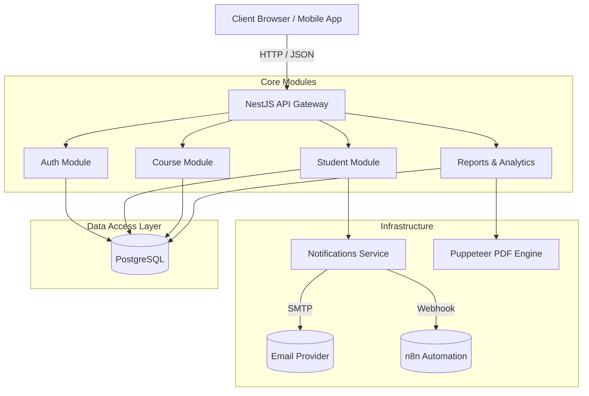

<div align="center">
  
  <h1>🎓 EduManage</h1>
  <p><strong>Enterprise-Grade Student Management System</strong></p>

  <p>
    <a href="#features">Features</a> •
    <a href="#tech-stack">Tech Stack</a> •
    <a href="#architecture">Architecture</a> •
    <a href="#getting-started">Getting Started</a> •
    <a href="#api-reference">API</a> •
    <a href="#testing">Testing</a>
  </p>

  <p>
    
    
    
    
    
  </p>
</div>

---

## 📖 Overview

**EduManage** is a production-ready, full-stack academic administration platform engineered to streamline the educational lifecycle. Built on the robust **NestJS** framework and powered by **PostgreSQL**, EduManage provides a secure, role-based ecosystem for Administrators, Teachers, and Students. 

Originally developed as a capstone engineering project, it features complex workflows such as automated PDF transcript generation, real-time analytics, n8n webhook automations, and a robust REST API capable of serving both server-side rendered views and headless mobile clients.

---

## ✨ Key Features

### 🛡️ Enterprise Security & Identity
- **Role-Based Access Control (RBAC):** Distinct routing, guards, and portals for `Admin`, `Teacher`, and `Student` roles.
- **Stateless Authentication:** Secure, HTTP-only JWT cookie-based session management.
- **Audit Trails:** Comprehensive logging of all critical mutations across the platform.

### 📚 Core Academic Operations
- **Student Lifecycle Management:** Full CRUD operations with bulk CSV import and profile photo uploads.
- **Course & Enrollment Tracking:** Dynamic course assignment with duplicate prevention and capacity tracking.
- **Attendance & Grading:** Daily attendance logging, multi-format exam recording, and real-time GPA/Grade calculation.

### 🚀 Advanced Integrations (v2)
- **Document Generation:** On-the-fly PDF generation of official student transcripts using headless Puppeteer.
- **Event-Driven Automations:** Outbound n8n/Zapier webhooks and automated Nodemailer email alerts for key events (e.g., enrollment, low attendance).
- **Advanced Analytics:** Departmental performance heatmaps and predictive attendance algorithms.
- **Headless API Mode:** Global request interception supporting `Accept: application/json` for seamless mobile app integration.

---

## 🛠️ Tech Stack

| Category | Technologies |
|---|---|
| **Core Framework** | Node.js, NestJS, TypeScript |
| **Database & ORM** | PostgreSQL, TypeORM |
| **Authentication** | Passport.js, JWT, bcrypt |
| **Frontend Rendering**| EJS, TailwindCSS, Chart.js |
| **Document & Files** | Puppeteer (PDFs), Multer (Uploads), csv-parser |
| **Infrastructure** | Docker, Docker Compose |
| **Quality Assurance**| Playwright (E2E), Jest (Unit/Integration) |

---

## 🏗️ Architecture

EduManage employs a modular, domain-driven architecture heavily utilizing Dependency Injection.



---

## 🚦 Getting Started

### Prerequisites
- [Docker](https://docs.docker.com/get-docker/) & Docker Compose (Recommended)
- Node.js ≥ 18.0.0 (For local development)
- PostgreSQL ≥ 15 (For local development)

### Option A: Docker Deployment (Fastest)

1. **Clone the repository:**
   ```bash
   git clone https://github.com/YOUR_ORG/edumanage.git
   cd edumanage
   ```

2. **Configure Environment:**
   ```bash
   cp .env.example .env
   # Ensure DB_HOST=db inside .env for Docker networking
   ```

3. **Spin up the stack:**
   ```bash
   docker-compose up -d --build
   ```
   *The application will automatically build the NestJS server, provision the PostgreSQL container, and expose the UI on `http://localhost:3000`.*

### Option B: Local Development

1. **Install Dependencies:**
   ```bash
   npm install --legacy-peer-deps
   ```

2. **Configure Database:**
   Update your `.env` with local PostgreSQL credentials.
   ```sql
   CREATE DATABASE edumanage;
   ```

3. **Seed Initial Admin:**
   ```bash
   npm run seed
   ```
   *(Creates default admin: `admin@edumanage.edu` / `admin123`)*

4. **Start the Application:**
   ```bash
   npm run start:dev
   ```

---

## 🌐 API Reference

EduManage provides a comprehensive REST API. You can import the full Postman collection to test the endpoints interactively.

**Postman Collection:** `postman/EduManage.postman_collection.json`

### Content Negotiation
The API dynamically responds based on the `Accept` header:
- `Accept: text/html` ➔ Returns Server-Side Rendered EJS Views (Default browser behavior).
- `Accept: application/json` ➔ Returns raw JSON payloads for headless client consumption.

---

## 🧪 Testing

The platform includes an automated End-to-End (E2E) testing suite powered by Playwright to ensure critical user flows (like Authentication) remain stable.

**Run E2E Tests:**
```bash
# Ensure the development server is running, or let Playwright start it
npx playwright test

# View the HTML test report
npx playwright show-report
```

---

## 📁 Project Structure

```text
├── .github/                # CI/CD Workflows (Optional)
├── database/scripts/       # TypeORM Seeding Scripts
├── e2e/                    # Playwright End-to-End Tests
├── src/                    
│   ├── analytics/          # Heatmaps & Predictions Domain
│   ├── auth/               # RBAC & Passport Strategies
│   ├── common/             # Global Middlewares (API Mode)
│   ├── notifications/      # SMTP & Webhook Services
│   ├── reports/            # Puppeteer PDF Generation
│   └── students/           # Student CRUD & Portals
├── views/                  # EJS Template Engine
├── Dockerfile              # Multi-stage production build
├── docker-compose.yml      # Container orchestration
└── playwright.config.ts    # Test configuration
```

---

## 🤝 Contributing


> All routes are prefixed with `/api`. JWT cookie required for all protected routes.

### Authentication

| Method | Endpoint | Auth | Description |
|--------|----------|------|-------------|
| `GET` | `/api/login` | Public | Portal selection page |
| `GET` | `/api/login/admin` | Public | Admin login page |
| `GET` | `/api/login/teacher` | Public | Teacher login page |
| `POST` | `/auth/login` | Public | Login → sets JWT cookie |
| `POST` | `/auth/register` | Admin | Register new user |
| `GET` | `/api/logout` | Auth | Clear session |

### Students

| Method | Endpoint | Auth | Description |
|--------|----------|------|-------------|
| `GET` | `/api/students` | Auth | List + search + paginate |
| `GET` | `/api/students/add` | Admin/Teacher | Add student form |
| `POST` | `/api/students/add` | Admin/Teacher | Create student + webhook |
| `GET` | `/api/students/:id` | Auth | Student profile |
| `GET` | `/api/students/:id/edit` | Admin/Teacher | Edit form |
| `POST` | `/api/students/:id/edit` | Admin/Teacher | Update student |
| `POST` | `/api/students/:id/delete` | Admin | Delete student |

### Courses

| Method | Endpoint | Auth | Description |
|--------|----------|------|-------------|
| `GET` | `/api/courses` | Auth | Course list |
| `POST` | `/api/courses/add` | Admin | Create course |
| `POST` | `/api/courses/:id/edit` | Admin/Teacher | Update course |
| `POST` | `/api/courses/:id/delete` | Admin | Delete course |

### Enrollment

| Method | Endpoint | Auth | Description |
|--------|----------|------|-------------|
| `GET` | `/api/enrollment` | Auth | Enrollment list |
| `POST` | `/api/enrollment` | Admin/Teacher | Enroll student |
| `POST` | `/api/enrollment/:id/status` | Admin/Teacher | Update status |
| `POST` | `/api/enrollment/:id/delete` | Admin | Remove enrollment |

### Attendance

| Method | Endpoint | Auth | Description |
|--------|----------|------|-------------|
| `GET` | `/api/attendance` | Auth | Attendance list + filter |
| `GET` | `/api/attendance/mark` | Teacher | Mark attendance form |
| `POST` | `/api/attendance/mark` | Teacher | Submit attendance |
| `POST` | `/api/attendance/:id/status` | Teacher | Update status |

### Marks

| Method | Endpoint | Auth | Description |
|--------|----------|------|-------------|
| `GET` | `/api/marks` | Auth | Marks + grade distribution |
| `GET` | `/api/marks/add` | Teacher | Add marks form |
| `POST` | `/api/marks/add` | Teacher | Save marks (auto-grades) |
| `GET` | `/api/marks/:id/edit` | Teacher | Edit form |
| `POST` | `/api/marks/:id/edit` | Teacher | Update marks + grade |
| `POST` | `/api/marks/:id/delete` | Admin/Teacher | Delete record |

### Logs, Settings & Dashboard

| Method | Endpoint | Auth | Description |
|--------|----------|------|-------------|
| `GET` | `/api/dashboard` | Auth | Stats + charts |
| `GET` | `/api/logs` | Admin | Audit trail + filters |
| `GET` | `/api/settings/profile` | Auth | Profile page |
| `POST` | `/api/settings/profile` | Auth | Update name |
| `POST` | `/api/settings/password` | Auth | Change password |

### Student Portal

| Method | Endpoint | Auth | Description |
|--------|----------|------|-------------|
| `GET` | `/api/student-portal` | Student | Student dashboard |
| `GET` | `/api/student-portal/marks` | Student | Own marks |
| `GET` | `/api/student-portal/attendance` | Student | Own attendance |
| `POST` | `/api/student-portal/password` | Student | Change password |

---

## 📬 Postman Collection

Import the full API collection into Postman for instant testing:

```
postman/EduManage.postman_collection.json
```

**Steps:**
1. Open Postman → **Import** → select the `.json` file
2. Set environment variable: `baseUrl = http://localhost:3000`
3. Run **Auth → Login** first to set the JWT cookie
4. All other requests are pre-configured and ready to run

---

## 🎓 Grade Calculation

Grades are calculated **automatically** from marks percentage. A live preview updates as you type.

| Percentage | Grade | Description |
|------------|-------|-------------|
| 90 – 100 | **A+** | Outstanding |
| 80 – 89 | **A** | Excellent |
| 70 – 79 | **B** | Good |
| 60 – 69 | **C** | Average |
| 50 – 59 | **D** | Below Average |
| < 50 | **F** | Fail |

---

## 👥 Roles & Permissions

| Action | Admin | Teacher | Student |
|--------|:-----:|:-------:|:-------:|
| View dashboard | ✅ | ✅ | — |
| Manage students (CRUD) | ✅ | ✅ | — |
| Manage courses | ✅ | ✅ | — |
| Enroll students | ✅ | — | — |
| Mark attendance | ✅ | ✅ | — |
| Add/edit marks | ✅ | ✅ | — |
| Delete records | ✅ | — | — |
| View activity logs | ✅ | — | — |
| Register new users | ✅ | — | — |
| View own marks/attendance | — | — | ✅ |
| Student portal | — | — | ✅ |

---

## 🔮 Future Improvements

### Version 2 Roadmap

- [ ] **Email Notifications** — Send automated emails on enrollment, low attendance alerts, and marks published using Nodemailer or SendGrid
- [ ] **n8n Automation Workflows** — Full workflow: new student → Google Sheet log → welcome email → Slack notification
- [ ] **PDF Report Generation** — Export student transcripts, attendance reports, and course summaries using Puppeteer or PDFKit
- [ ] **REST API Mode** — Add `Accept: application/json` support alongside EJS rendering for mobile app consumption
- [ ] **Advanced Analytics** — Department-level performance heatmaps, attendance trend prediction
- [ ] **File Uploads** — Student photo upload, bulk import via CSV
- [ ] **Docker Support** — `docker-compose.yml` for one-command deployment
- [ ] **End-to-End Tests** — Playwright/Cypress test suite for critical flows
- [ ] **Redis Caching** — Cache dashboard stats to reduce DB load
- [ ] **Swagger API Docs** — Auto-generated interactive API documentation via `@nestjs/swagger`

---

## 👨‍💻 Author

**Devprasath (Deva)**

Smackcoders Internship Capstone — 2026

> Built from scratch during a backend engineering internship — covering full-stack NestJS architecture, relational database design, JWT authentication, role-based access control, and server-side rendering.
We welcome contributions to EduManage! Please adhere to the following workflow:
1. Fork the repository.
2. Create a feature branch (`git checkout -b feature/amazing-feature`).
3. Commit your changes adhering to [Conventional Commits](https://www.conventionalcommits.org/).
4. Ensure all tests pass (`npm run test` & `npx playwright test`).
5. Open a Pull Request.

---

## 📄 License

Distributed under the **MIT License**. See `LICENSE` for more information.

<div align="center">
  <p>Engineered by <strong>Dev Prasath Bharanidharan</strong> | Smackcoders Capstone 2026</p>
</div>